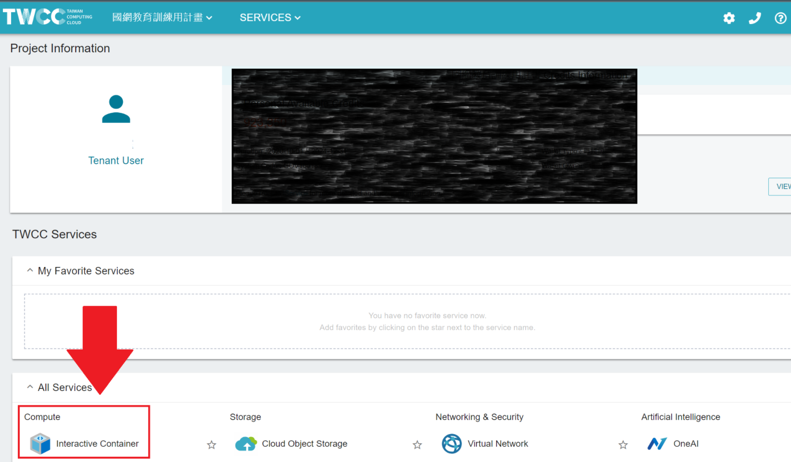
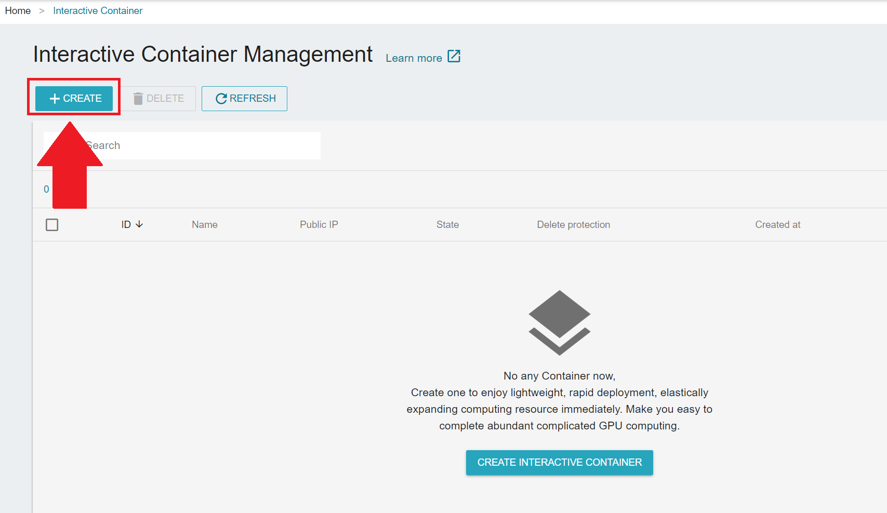

# Running CUDA-Q on Taiwan Computing Cloud (TWCC)

Learn more about [CUDA-Q] and follow the steps below to set up:

 1. Sign up [TWCC](https://www.twcc.ai/)

    

 2. Log in and navigate to **Interactive Container** on the dashboard

    

 3. Select **CREATE** to set up a container

    

 4. Search and select **CUDA Quantum** then specify compute resources and storage, etc.

    

 5. Click on the container (after initialization) to see more details and **LAUNCH** Jupyter Notebook

    

 6. Within Jypyter Notebook open a **Terminal** and run the following commands to access built-in tutorials inside CUDA Quantum

    

    ```shell
    sudo chown -R `stat . -c %u:%g` /home/cudaq/
    cp -r /home/cudaq/ ~/cudaq
    ```

 7. To access additional tutorials in this repository, use the following `git clone` command

    ```shell
    git clone https://github.com/Squirtle007/CUDA_Quantum.git
    ```

<!--
  vim: ft=markdown ic wrap noet norl sw=8 ts=8 sts=4:
  -->
