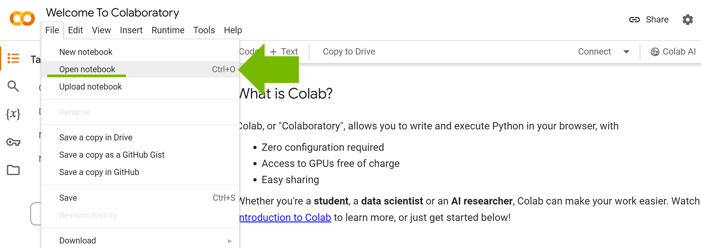
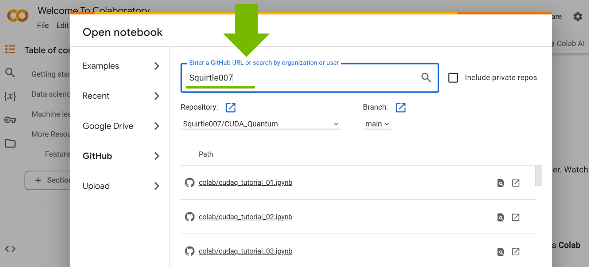
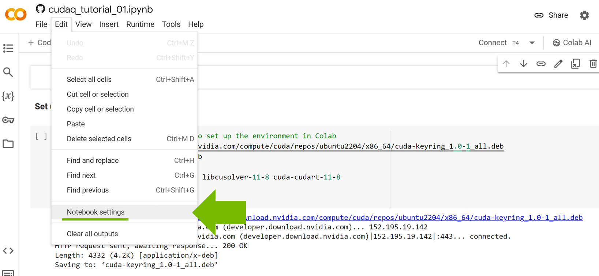

# Running CUDA-Q on [Colab](https://colab.research.google.com/)

Follow the steps below to run cudaq tutorials with free T4 GPU backend

 1. Log in [Colab](https://colab.research.google.com/) and click on the `open notebook` under the `file` tab

    

 2. To access tutorials in this repository, search this repository in the `GitHub` catalog with:

    ```
    Squirtle007/CUDA_Quantum
    ```

    
    
 3. Make sure to select `Runtime > Change runtime type > T4 GPU` as the backend for acceleration

    

    

 4. Set up CUDA Quantum properly in the Colab environment using the following commands (at the very beginning)

    ```
    !wget https://developer.download.nvidia.com/compute/cuda/repos/ubuntu2204/x86_64/cuda-keyring_1.0-1_all.deb
    !dpkg -i cuda-keyring_1.0-1_all.deb
    !apt-get update
    !apt-get -y install libcublas-11-8 libcusolver-11-8 cuda-cudart-11-8
    
    %pip install cuda-quantum==0.6.0
    ```

    
