# PhysicsNeMo AI-Powered Physics Bootcamp  &mdash;  完整環境建置手冊

> [!NOTE]
> **閱讀說明**：本檔案為自給自足的操作手冊，所有指令與設定檔內容皆內嵌於此。在一臺全新的Linux VM（GPU：NVIDIA H200）上，依序執行各步驟即可完成環境建置。
>
> Base image使用官方`nvcr.io/nvidia/physicsnemo/physicsnemo`，託管於**NGC公開Catalog，可直接`docker pull`無需API Key或帳號登入**，與bootcamp官方Dockerfile一致。
>
> **教學素材來源**：[AI-Powered-Physics-Bootcamp](https://github.com/openhackathons-org/AI-Powered-Physics-Bootcamp)

---

## 前置作業｜在NCHC雲平臺建立VM

> 平臺網址：<https://ai-cloud.iic.nchc.org.tw/>

### NCHC-1. 登入平臺

前往 <https://ai-cloud.iic.nchc.org.tw/> 登入，確認專案名稱為「NCHC-NVIDIA Joint Lab教育訓練」（專案ID：GOV114072）。

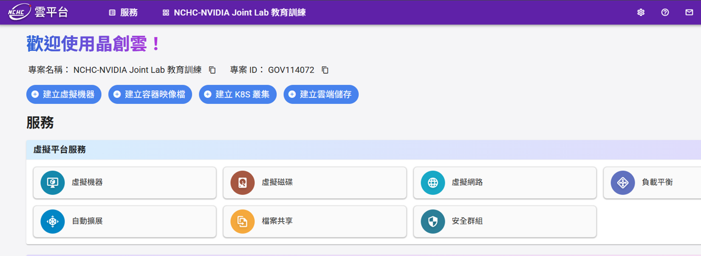

### NCHC-2. 建立安全群組

在首頁（如NCHC-1截圖）服務區塊中，點擊「安全群組」，進入「安全群組管理」頁面，點擊「＋建立」。

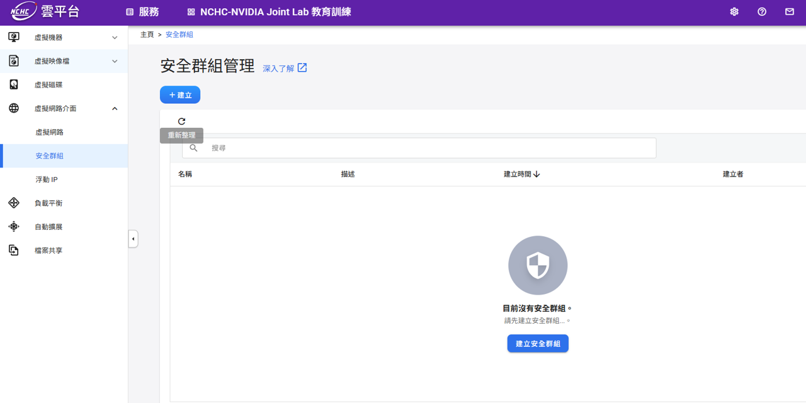

進入「建立安全群組」頁面，「名稱」欄位保留預設值（例如：`sg1772642623211`），點擊「下一步：規則設定>」。

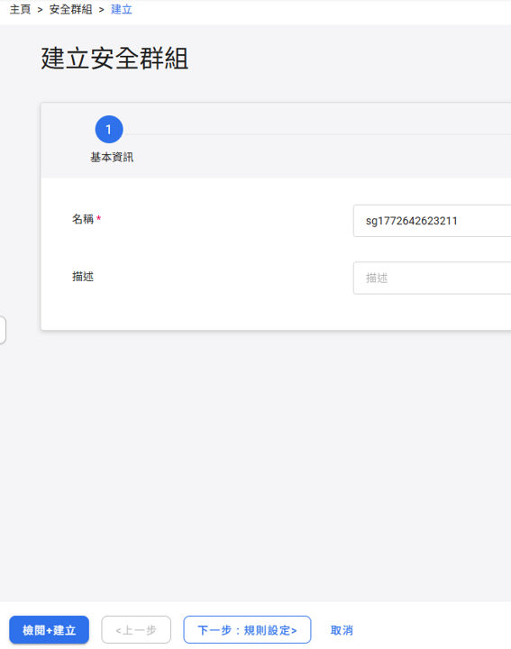

進入規則設定頁面，預設已有一條`egress ipv4`規則。點擊「新增安全群組規則」。

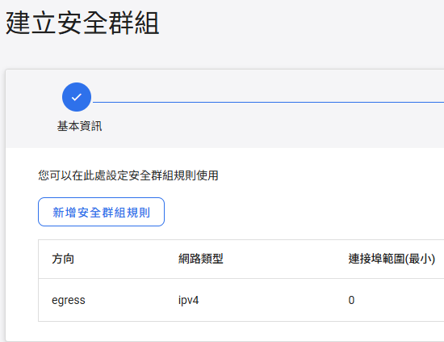

新增「SSH (port 22)」規則，欄位填寫如下：

| 欄位			| 填寫內容 |
| ----			| :------: |
| 方向			| `ingress` |
| 連接埠範圍（最小）	| `22` |
| 連接埠範圍（最大）	| `22` |
| 協定			| `tcp` |
| CIDR			| 填入當下用戶的IP（見下方說明） |

> [!TIP]
> **如何取得CIDR？**
>
> 1. 前往 <https://www.whatismyip.com.tw/en/> 查詢目前的公開IP（例如：`123.123.123.45`）
> 2. 若只允許單一IP連線：填入`123.123.123.45/32`
> 3. 若允許整個網段（例如辦公室IP範圍）：填入`123.123.123.0/24`

填寫完成後點擊「確定」。

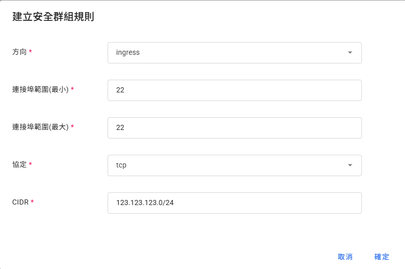

規則新增完成後，清單中應出現`egress`與`ingress port 22`兩條規則。確認後點擊「下一步：檢閱+建立>」。

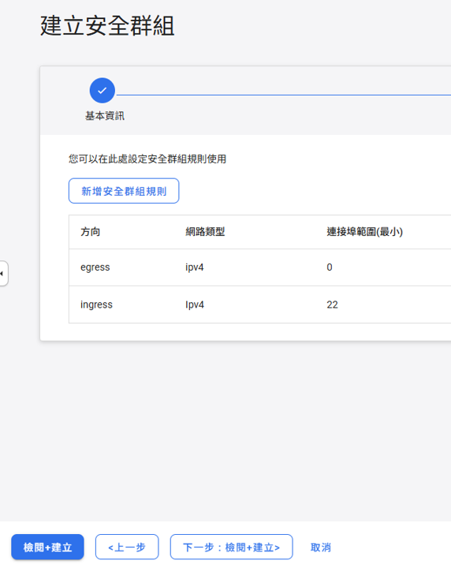

確認名稱與規則（egress + ingress port 22）無誤後，點擊左下角「建立」。

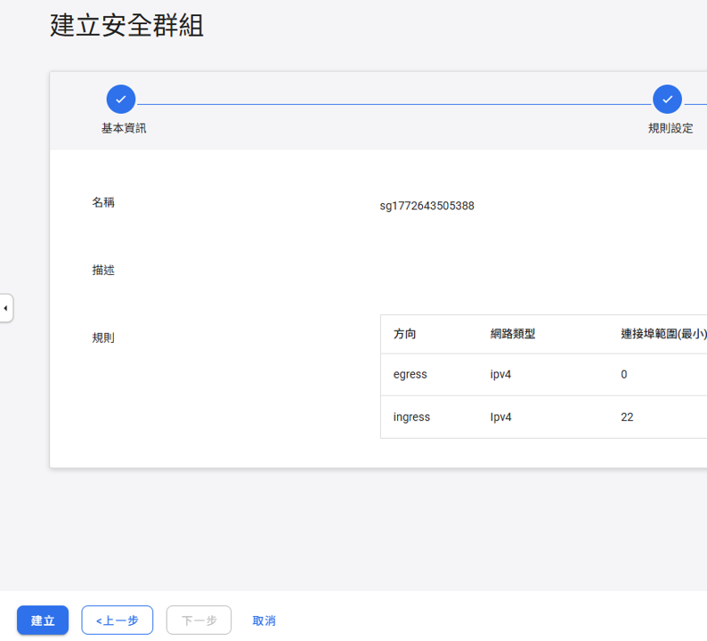

安全群組建立完成。

### NCHC-3. 進入虛擬機器管理頁面

在左側選單點擊「虛擬機器」&rarr;「虛擬機器管理」，進入管理頁面後點擊「＋建立」。

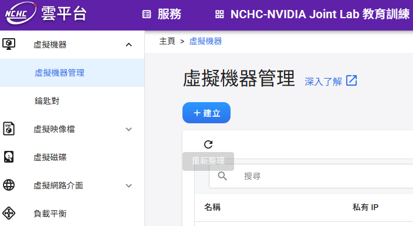

### NCHC-4. 基本設定

進入「建立虛擬機器」頁面，共分六步驟：「基本設定」&rarr;「硬體設定」&rarr;「虛擬網路」&rarr;「儲存資訊」&rarr;「認證」&rarr;「初始化指令」。

「基本設定」欄位填寫如下：

| 欄位		| 填寫內容 |
| ----		| -------- |
| 名稱		| 自訂（例如：`vm1772640765`） |
| 描述		| （選填） |
| 映像檔來源	| 點擊「選擇」&rarr;選擇**Ubuntu** |
| 映像檔標籤	| **24.04** |

填寫完成後，確認如圖所示，點擊「下一步：硬體設定>」。

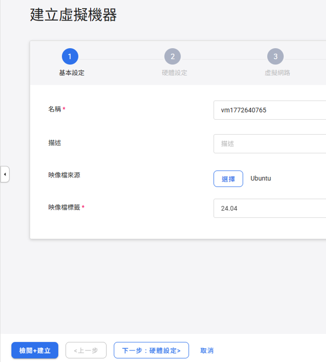

### NCHC-5. 硬體設定

選擇型號「`GPU.small`」，點擊「下一步：虛擬網路>」。

| 型號		        | GPU型號	| GPU (張)	| CPU (Cores)	| 記憶體 (GiB)	| 開機磁碟 (GiB) |
| ----		        | :-----:	| :------:	| :---------:	| :----------:	| :------------: |
| GPU.large		| H200		| 2		| 192		| 1024		| 120 |
| **GPU.small**&#x2705;	| **H200**	| **1**		| **96**	| **512**	| **120** |
| CPU.medium		| -		| 0		| 16		| 32		| 120 |

> [!NOTE]
> **為何選GPU.small？**
>
> PhysicsNeMo需要NVIDIA H200 GPU（建議 &ge;20 GB VRAM）、&ge;32 GB RAM、Ubuntu 22.04+、可連外網路。GPU.small提供H200&times;1、512 GiB RAM、Ubuntu 24.04，完全符合需求。

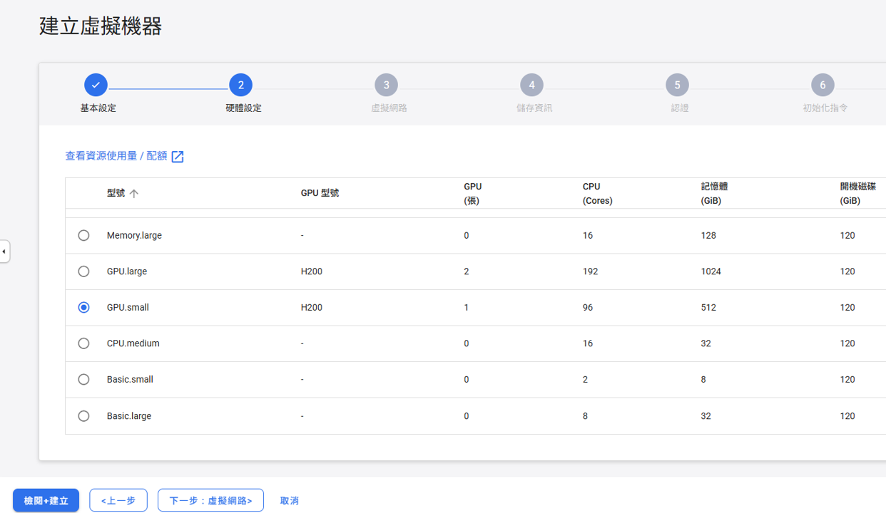

### NCHC-6. 虛擬網路設定

進入「虛擬網路」步驟，清單顯示`No data available`，需至少新增一張虛擬網卡。點擊「新增虛擬網卡」。

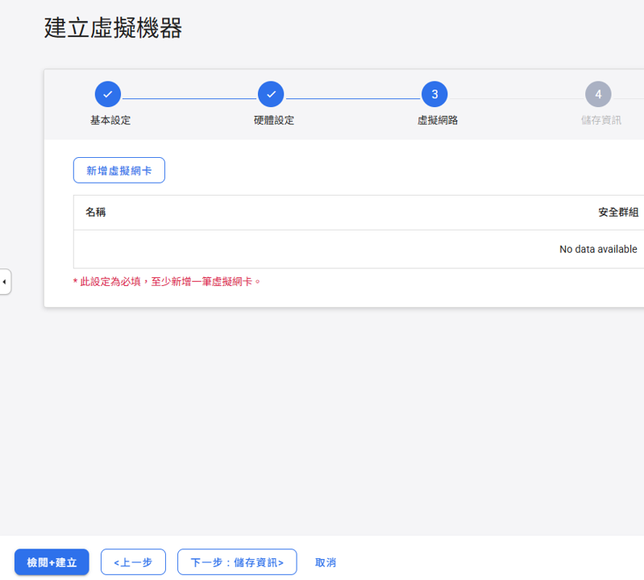

在「新增虛擬網卡」對話框中填寫：

| 欄位	        | 填寫內容 |
| ----	        | -------- |
| 虛擬網路	| `bootcamp` |
| 安全群組	| 選擇剛才建立的安全群組（例如：`sg1772643505388`） |

填寫完成後點擊「確定」。

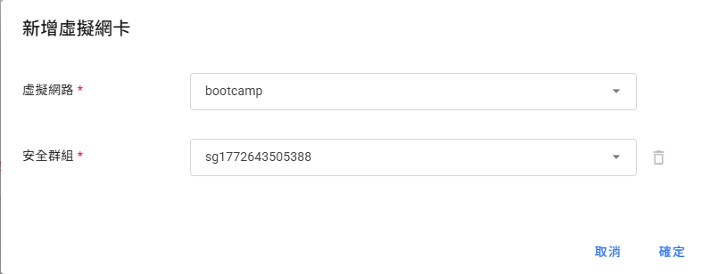

確認清單出現`bootcamp`網路及對應安全群組後，點擊「下一步：儲存資訊>」。

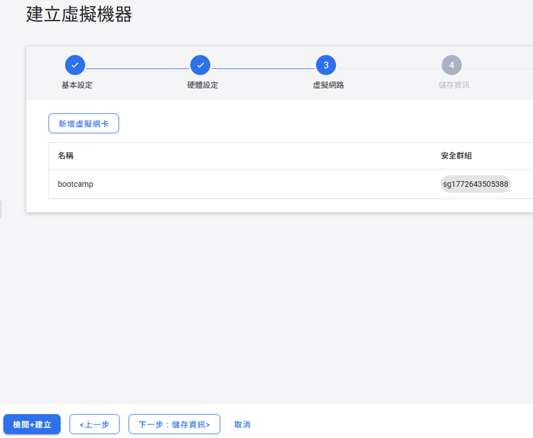

### NCHC-7. 儲存資訊（建立虛擬磁碟）

進入「儲存資訊」步驟，點擊「建立虛擬磁碟」。

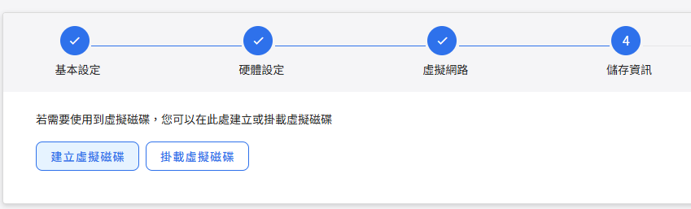

在「建立虛擬磁碟」對話框中填寫：

| 欄位		| 填寫內容 |
| ----		| -------- |
| 名稱		| 保留預設（例如：`vol1772681329`） |
| 描述		| （選填） |
| 容量 (GiB)	| **100** |
| 類型		| `SSD` |

填寫完成後點擊「確定」。

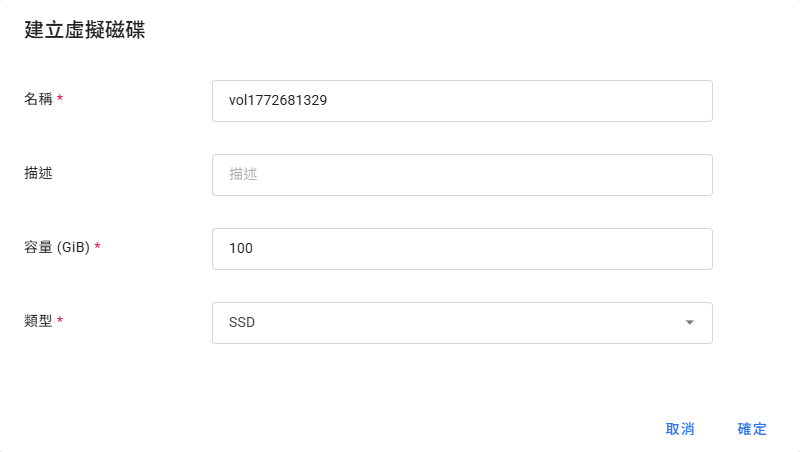

確認清單出現磁碟名稱與容量（100 GiB）後，點擊「下一步：認證>」。

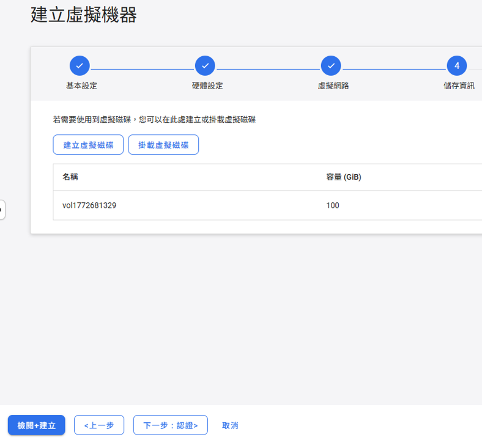

### NCHC-8. 認證設定

進入「認證」步驟：

| 欄位		| 填寫內容 |
| ----		| -------- |
| 鑰匙對認證	| **停用** |
| 密碼		| \<PASSWORD\> |

> [!IMPORTANT]
> **請務必記住此密碼**，後續SSH連線至VM時會需要輸入。

密碼設定完成後，點擊「下一步：初始化指令>」。

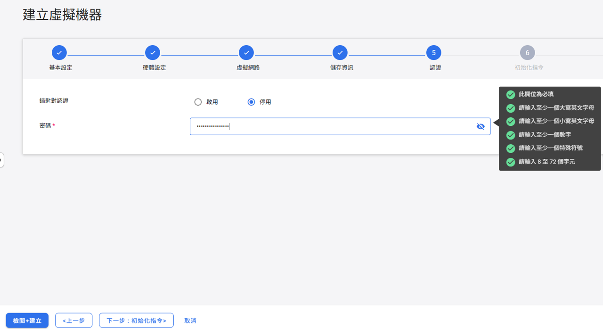

### NCHC-9. 初始化指令

「初始化指令」欄位保留空白，直接點擊「下一步：檢閱+建立>」。


### NCHC-10. 檢閱並建立VM

進入最後的「檢閱+建立」步驟，確認以下設定無誤：

| 項目	        | 確認內容 |
| ----	        | -------- |
| 名稱	        | `vm...`（自動產生） |
| 映像檔來源	| `Ubuntu` |
| 映像檔標籤	| `24.04` |
| 硬體設定	| `GPU.small` |
| 虛擬網路	| `bootcamp`+安全群組 |

確認後點擊左下角「建立」。

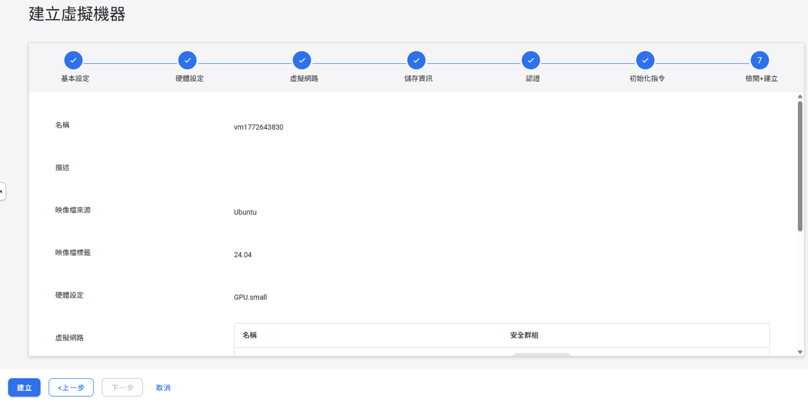

### NCHC-11. 等待VM啟動並取得IP

建立後回到「虛擬機器管理」頁面，等待數分鐘，狀態由**build**變為**active**即表示VM已就緒。

點擊VM名稱進入詳細頁面，後續步驟將在此取得**浮動IP**。

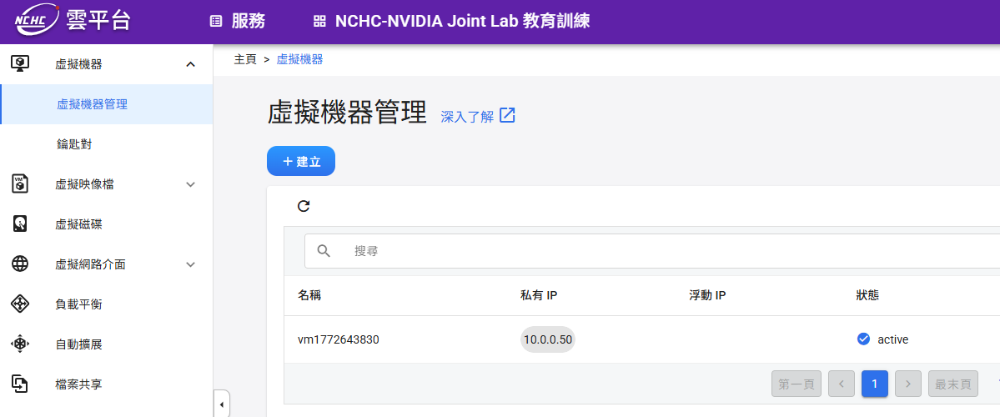

進入VM詳細資料頁面，確認：

 -  **狀態**：active
 -  **登入帳號**：ubuntu

在「虛擬網路資訊」區塊中，點擊`bootcamp`列右側的「&vellip;」按鈕，選擇「配置浮動IP」。

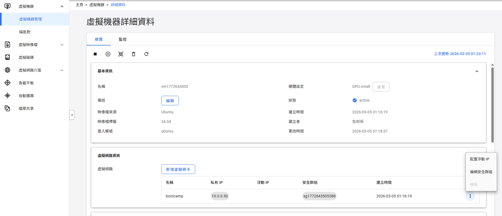

在「配置浮動IP」對話框中選擇「自動配置浮動IP」，點擊「確定」。

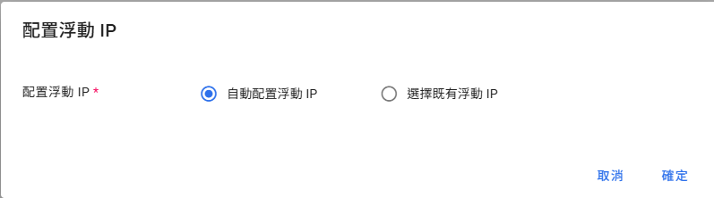

配置完成後，虛擬網路資訊欄位會顯示**浮動IP**（例如：`140.110.108.39`），此即為從外部SSH連線時使用的IP。

> [!IMPORTANT]
> **請記下或複製此浮動IP**，下一步SSH連線時會需要用到。

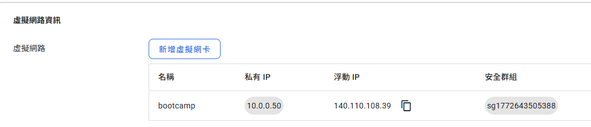

### NCHC-12. SSH連線至VM

**先在本機開啟Terminal：**

| 平臺	        | 開啟方式 |
| ----	        | -------- |
| **Windows**	| 開始選單搜尋`PowerShell`或`cmd`，或安裝[Windows Terminal](https://aka.ms/terminal) |
| **macOS**	| `Spotlight` (<kbd>&#x2318;</kbd>+<kbd>Space</kbd>)搜尋`Terminal`，或至「應用程式&rarr;工具程式&rarr;終端機」 |
| **Linux**	| 快捷鍵<kbd>Ctrl</kbd>+<kbd>Alt</kbd>+<kbd>T</kbd>，或在應用程式選單中搜尋`Terminal` |

> [!NOTE]
> Windows 10/11內建的PowerShell與`cmd`均支援`ssh`指令，無需額外安裝。

使用浮動IP從本機連線至VM：

```bash
ssh ubuntu@<浮動IP>
```

例如：

```bash
ssh ubuntu@140.110.108.39
```

輸入建立VM時設定的**密碼**即可登入。

> [!IMPORTANT]
> 密碼：\<PASSWORD\>

---

## 流程總覽

 -  步驟1｜確認GPU可見
 -  步驟2｜安裝NVIDIA Driver（如未安裝）
 -  步驟3｜安裝Docker Engine
 -  步驟4｜安裝NVIDIA Container Toolkit
 -  步驟5｜設定Docker daemon支援GPU
 -  步驟6｜建立工作目錄
 -  步驟7｜Clone bootcamp教材
 -  步驟8｜建立Dockerfile
 -  步驟9｜建置Docker Image
 -  步驟10｜啟動JupyterLab
 -  步驟11｜開始上機教學
 -  步驟12｜關閉VM（課程結束後）

---

## 步驟1｜確認GPU可見

```bash
lspci | grep -i nvidia
```

預期輸出：

```
06:00.0 3D controller: NVIDIA Corporation Device 233b (rev a1)
```

 -  `3D controller`（非`VGA compatible controller`）是資料中心GPU的正常顯示方式。
 -  Device ID `233b`對應H200 NVL。若無任何輸出，請確認VM已正確配置GPU passthrough。

---

## 步驟2｜安裝NVIDIA Driver

### 2-1. 確認目前是否已安裝Driver

```bash
nvidia-smi
```

 -  若指令執行成功且Driver Version &ge; 535，**跳至步驟3**。
 -  若指令不存在或版本過舊，繼續以下步驟。

### 2-2. 更新系統並安裝必要工具

```bash
sudo apt-get update
sudo apt-get upgrade -y
sudo apt-get install -y \
    build-essential \
    curl wget git \
    software-properties-common \
    linux-headers-$(uname -r)
```

> [!NOTE]
> `linux-headers-$(uname -r)`為必要項目：NVIDIA driver透過DKMS編譯核心模組時需要對應的kernel headers，若缺少此套件，driver安裝後`nvidia-smi`仍會失敗。

### 2-3. 安裝Driver

Ubuntu 22.04/24.04的預設repo已內建nvidia-driver-570，**不需要加PPA**：

```bash
sudo apt-get install -y nvidia-driver-570
```

### 2-4. 重新開機（Driver安裝後必須重開機）

```bash
sudo reboot
```

> - 重開機後VM需要約**1&ndash;2分鐘**才會重新接受SSH連線，請稍候再重新登入。
> - 登入密碼：\<PASSWORD\>

### 2-5. 重開機後確認Driver安裝成功

```bash
nvidia-smi
```

預期輸出範例：

```
+-----------------------------------------------------------------------------------------+
| NVIDIA-SMI 570.211.01             Driver Version: 570.211.01     CUDA Version: 12.8     |
|-----------------------------------------+------------------------+----------------------+
| GPU  Name                 Persistence-M | Bus-Id          Disp.A | Volatile Uncorr. ECC |
| Fan  Temp   Perf          Pwr:Usage/Cap |           Memory-Usage | GPU-Util  Compute M. |
|=========================================+========================+======================|
|   0  NVIDIA H200 NVL                Off |   00000000:06:00.0 Off |                    0 |
| N/A   33C    P0             69W /  600W |       0MiB / 143771MiB |      0%      Default |
+-----------------------------------------+------------------------+----------------------+
```

---

## 步驟3｜安裝Docker Engine

### 3-1. 移除舊版（若存在）

```bash
sudo apt-get remove -y docker docker-engine docker.io containerd runc 2>/dev/null || true
```

### 3-2. 設定Docker官方APT repository

```bash
sudo apt-get install -y ca-certificates gnupg lsb-release
sudo install -m 0755 -d /etc/apt/keyrings

curl -fsSL https://download.docker.com/linux/ubuntu/gpg |
    sudo gpg --dearmor -o /etc/apt/keyrings/docker.gpg
sudo chmod a+r /etc/apt/keyrings/docker.gpg

echo "deb [arch=$(dpkg --print-architecture) \
    signed-by=/etc/apt/keyrings/docker.gpg] \
    https://download.docker.com/linux/ubuntu \
    $(lsb_release -cs) stable" |
    sudo tee /etc/apt/sources.list.d/docker.list > /dev/null
```

### 3-3. 安裝Docker Engine

```bash
sudo apt-get update
sudo apt-get install -y \
    docker-ce \
    docker-ce-cli \
    containerd.io \
    docker-buildx-plugin \
    docker-compose-plugin
```

### 3-4. 啟動並設定Docker開機自動啟動

```bash
sudo systemctl start docker
sudo systemctl enable docker
```

### 3-5. 將目前用戶加入docker群組（避免每次都需sudo）

```bash
sudo usermod -aG docker $USER
```

> 群組變更需**重新登入SSH**才會生效。

登出目前session：

```bash
exit
```

重新SSH登入後，再繼續以下步驟。

> 密碼：\<PASSWORD\>

### 3-6. 確認Docker安裝成功

```bash
docker --version
docker run --rm hello-world
```

預期`docker --version`輸出：

```
Docker version 29.2.1，build a5c7197
```

---

## 步驟4｜安裝NVIDIA Container Toolkit

此工具讓Docker container可以存取Host的GPU。

### 4-1. 加入NVIDIA Container Toolkit repository

```bash
curl https://nvidia.github.io/libnvidia-container/gpgkey -fsSL |
    sudo gpg --dearmor -o /usr/share/keyrings/nvidia-container-toolkit-keyring.gpg

curl https://nvidia.github.io/libnvidia-container/stable/deb/nvidia-container-toolkit.list -fsSL |
    sed 's#deb https://#deb [signed-by=/usr/share/keyrings/nvidia-container-toolkit-keyring.gpg] https://#g' |
    sudo tee /etc/apt/sources.list.d/nvidia-container-toolkit.list
```

### 4-2. 安裝

```bash
sudo apt-get update
sudo apt-get install -y nvidia-container-toolkit
```

### 4-3. 確認安裝版本

```bash
nvidia-ctk --version
```

預期輸出：

```
NVIDIA Container Toolkit CLI version 1.18.2
```

---

## 步驟5｜設定Docker daemon支援GPU

### 5-1. 寫入Docker daemon設定檔

```bash
sudo tee /etc/docker/daemon.json > /dev/null << 'EOF'
{
    "default-runtime": "nvidia"，
    "runtimes": {
    "nvidia": {
        "path": "/usr/bin/nvidia-container-runtime"，
        "runtimeArgs": []
    }
    }，
    "log-driver": "json-file"，
    "log-opts": {
    "max-size": "100m"，
    "max-file": "3"
    }
}
EOF
```

### 5-2. 重啟Docker daemon使設定生效

```bash
sudo systemctl restart docker
```

### 5-3. 驗證GPU在Docker內可見

```bash
docker run --rm --gpus all \
    nvidia/cuda:12.4.0-base-ubuntu22.04 \
    nvidia-smi --query-gpu=name,memory.total --format=csv,noheader
```

預期輸出：

```
NVIDIA H200 NVL, 143771 MiB
```

---

## 步驟6｜建立工作目錄

```bash
mkdir -p ~/physicsnemo-workshop
cd ~/physicsnemo-workshop
```

後續所有檔案都建立在此目錄內。

---

## 步驟7｜Clone bootcamp教材

將教材clone至家目錄，後續透過volume mount掛入container，修改的內容在container關閉後仍會保留。

```bash
cd ~
git clone https://github.com/openhackathons-org/AI-Powered-Physics-Bootcamp.git
```

---

## 步驟8｜建立Dockerfile

以下Dockerfile以bootcamp官方Dockerfile為基礎，加入JupyterLab設定。

Base image `nvcr.io/nvidia/physicsnemo/physicsnemo`托管於NGC公開Catalog，**直接pull即可，不需要API Key**，且已內含完整PhysicsNeMo、PhysicsNeMo-Sym (PINNs)與所有CUDA依賴。

直接複製整段貼到terminal執行：

```bash
cat > ~/physicsnemo-workshop/Dockerfile << 'DOCKERFILE_EOF'
# ============================================================
# PhysicsNeMo AI-Powered Physics Bootcamp
# Base: nvcr.io/nvidia/physicsnemo/physicsnemo:25.06
# →NGC公開Catalog, docker pull無需API Key
# →已內含PhysicsNeMo、PhysicsNeMo-Sym (PINNs)、CUDA完整環境
# JupyterLab on port 8888
# ============================================================

ARG PHYSICSNEMO_VERSION=25.06
FROM nvcr.io/nvidia/physicsnemo/physicsnemo:${PHYSICSNEMO_VERSION}

# --額外系統工具----------------------------------------------
USER root
RUN apt-get update && apt-get install -y --no-install-recommends \
        git \
        wget \
        curl \
        vim \
    && apt-get clean \
    && rm -rf /var/lib/apt/lists/*

# --Bootcamp額外Python依賴------------------------------------
RUN pip install --no-cache-dir \
        gdown \
        ipympl \
        cdsapi \
        jupyterlab>=4.0 \
        ipywidgets \
    && pip install --no-cache-dir --upgrade nbconvert

# --JupyterLab設定--------------------------------------------
RUN mkdir -p /root/.jupyter && \
    cat > /root/.jupyter/jupyter_lab_config.py << 'EOF'
c.ServerApp.ip = '0.0.0.0'
c.ServerApp.port = 8888
c.ServerApp.open_browser = False
c.ServerApp.allow_root = True
c.IdentityProvider.token = ''
c.ServerApp.password = ''
c.ServerApp.root_dir = '/workspace/AI-Powered-Physics-Bootcamp'
c.ServerApp.allow_origin = '*'
EOF

# ──Expose ports─────────────────────────────────────────────
EXPOSE 8888 8889

WORKDIR /workspace

CMD ["jupyter"，"lab"，"--ip=0.0.0.0"，"--port=8888"，"--no-browser"，"--allow-root"]
DOCKERFILE_EOF
```

確認檔案已建立：

```bash
cat ~/physicsnemo-workshop/Dockerfile
```

---

## 步驟9｜建置Docker Image

```bash
docker build -t physicsnemo-bootcamp:25.06 ~/physicsnemo-workshop/
```

** 預期耗時**：首次建置約**10–15分鐘**，主要耗時於：

 -  下載`nvcr.io/nvidia/physicsnemo/physicsnemo:25.06` base image（約15 GB）
 -  安裝少量額外pip套件（gdown、ipympl、jupyterlab等）

建置過程中各階段說明：

| 階段			        	| 說明 |
| ----		        		| ---- |
| `FROM nvcr.io/nvidia/physicsnemo`	| 下載官方NGC公開image（含完整PhysicsNeMo + CUDA） |
| `apt-get install`			| 安裝vim、curl等工具 |
| `pip install gdown ipympl ...`	| 安裝bootcamp額外依賴（數量少，速度快） |

建置完成後確認image存在：

```bash
docker images | grep physicsnemo-bootcamp
```

預期輸出：

```
WARNING: This output is designed for human readability. For machine-readable output, please use --format.
physicsnemo-bootcamp:25.06   <IMAGE_ID>   ...   49.2GB   16.9GB
```

> WARNING為Docker的正常提示訊息（輸出至stderr），非錯誤，可忽略。

---

## 步驟10｜啟動JupyterLab

### 10-1. 背景啟動容器

** 首次啟動**（尚未建立過容器）：

```bash
docker run -d \
    --name physicsnemo-bootcamp \
    --gpus all \
    --ipc=host \
    --ulimit memlock=-1 \
    --ulimit stack=67108864 \
    -p 8888:8888 \
    -p 8889:8889 \
    -e NVIDIA_VISIBLE_DEVICES=all \
    -e NVIDIA_DRIVER_CAPABILITIES=compute,utility \
    -v ~/AI-Powered-Physics-Bootcamp:/workspace/AI-Powered-Physics-Bootcamp \
    physicsnemo-bootcamp:25.06
```

> [!TIP]
> **容器已存在時**（例如VM重開機後）：`docker run`會因名稱衝突而報錯。
>
> 請改用以下指令重新啟動已存在的容器：
>
> ```bash
> docker start physicsnemo-bootcamp
> ```

### 10-2. 確認容器正常執行

```bash
docker ps
```

預期輸出（`STATUS`顯示`Up`代表容器正在執行）：

```
CONTAINER ID   IMAGE                        COMMAND                  CREATED         STATUS         PORTS                                                                       NAMES
xxxxxxxxxxxx   physicsnemo-bootcamp:25.06   "/opt/nvidia/physics…"   X seconds ago   Up X seconds   6006/tcp, 0.0.0.0:8888-8889->8888-8889/tcp, [::]:8888-8889->8888-8889/tcp   physicsnemo-bootcamp
```

### 10-3. 查看啟動日誌

```bash
docker logs -f physicsnemo-bootcamp
```

看到以下訊息代表JupyterLab已就緒，按<kbd>Ctrl</kbd>+<kbd>C</kbd>離開log追蹤：

```
DEPRECATION: Loading egg at /usr/local/lib/python3.12/dist-packages/dill-...
DEPRECATION: Loading egg at /usr/local/lib/python3.12/dist-packages/lightning_thunder-...
...（數行DEPRECATION，可忽略）

========================
== NVIDIA PhysicsNeMo ==
========================

NVIDIA Release 25.06 (build 29613739)
PhysicsNeMo PyPi Version 1.1.0 (Git Commit: b7dd246)
PhysicsNeMo Sym PyPi Version 2.1.0 (Git Commit: 416de0a)
...
NOTE: CUDA Forward Compatibility mode ENABLED.
    Using CUDA 12.9 driver version 575.51.02 with kernel driver version 570.211.01.
...
[W 2026-xx-xx xx:xx:xx.xxx ServerApp] All authentication is disabled.  Anyone who can connect to this server will be able to run code.
...
[I 2026-xx-xx xx:xx:xx.xxx ServerApp] Serving notebooks from local directory: /workspace/AI-Powered-Physics-Bootcamp
[I 2026-xx-xx xx:xx:xx.xxx ServerApp] Jupyter Server 2.15.0 is running at：
[I 2026-xx-xx xx:xx:xx.xxx ServerApp] http://hostname:8888/lab
[I 2026-xx-xx xx:xx:xx.xxx ServerApp]     http://127.0.0.1:8888/lab
```

 -  啟動時出現的`DEPRECATION`與`UserWarning`為已知提示，不影響功能，可忽略。
 -  `All authentication is disabled`表示無需密碼或token，可直接開啟瀏覽器存取。

### 10-4. 開啟瀏覽器(SSH tunnel)

在本機**另開一個新的terminal**，建立SSH tunnel：

```bash
ssh -L 8888:localhost:8888 ubuntu@<VM_IP>
```

輸入密碼後會出現遠端shell提示符(`ubuntu@vm:~$`)，**保持此terminal開啟**，tunnel即持續運作。

> 密碼：\<PASSWORD\>

在本機瀏覽器開啟：

```
http://localhost:8888
```

> 結束使用後，在該terminal輸入`exit`即可關閉tunnel並登出VM。

> **若為Cloud VM**（AWS/Azure/GCP）且可直接存取VM public IP：
> 請在Security Group / Firewall Rules中開放TCP port 8888的Inbound流量，然後直接在瀏覽器輸入`http://<VM_IP_ADDRESS>:8888`。

---

## 步驟11｜開始上機教學

進入JupyterLab後，在左側檔案瀏覽器找到並開啟**`Start_Here.ipynb`**：

```
/workspace/AI-Powered-Physics-Bootcamp/
├──Start_Here.ipynb              ←從這裡開始
│
├──tutorial/                      Tutorial（約2小時）
│   ├──Lab1_intro_to_pinn/        Physics-Informed Neural Networks (PINNs)
│   ├──Lab2_ode_pde/              求解ODE / PDE
│   ├──Lab3_diffusion/            Diffusion問題
│   └──Lab4_advanced_pde/        進階PDE系統
│
└──challenge/                     Challenge（約4小時）
    ├──Challenge1_wave/           波動方程(Wave dynamics)
    ├──Challenge2_darcy/          Darcy flow
    ├──Challenge3_fourcastnet/    FourCastNet天氣預報
    └──Challenge4_mhd/           磁流體動力學(MHD)
```

** 建議教學順序**：Tutorial (2h)&rarr;Challenge (4h)，合計約6小時

### 11-1. 記分板提交

每跑完一個Challenge題目，分數會自動寫入challenge資料夾下的`leaderboard_metrics.csv`。

#### 下載CSV：

在JupyterLab左側檔案瀏覽器，切換到`challenge/`目錄，對`leaderboard_metrics.csv`按右鍵&rarr;選擇**Download**。

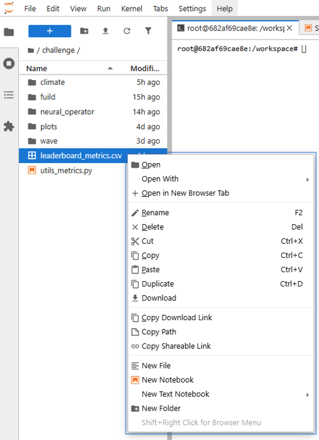

#### 上傳至記分板：

 1.將下載的`leaderboard_metrics.csv`壓縮成`.zip`檔，**檔名格式為`xxx_1.zip`**（`xxx`可自訂，例如團隊名稱）
 2.上傳至：[記分板Google Drive資料夾](https://drive.google.com/drive/folders/1nZRAMdVwUUBYQBVAuLsWDdEX4-GQan-x?usp=drive_link)

> [!NOTE]
> **注意事項**
>
> - **CSV檔名必須完全相同**：zip壓縮包內的檔案名稱必須是`leaderboard_metrics.csv`，一字不差。若檔名有任何變動（例如重新命名），背景表單將無法分析，分數欄位會顯示為`NA`。
> - **每次重新提交必須遞增編號**：若已上傳過`xxx_1.zip`，再次上傳同名`xxx_1.zip` **不會**更新記分板。請改用`xxx_2.zip`、`xxx_3.zip`（依序+1）重新上傳，`xxx`部分需與第一次相同。

---

## 步驟12｜關閉VM（課程結束後）

> [!NOTE]
> **執行前請確認**：已完成記分板提交（步驟11-1），且不再需要保留此VM。
> **刪除後無法復原。**

課程結束後，回到NCHC雲平臺的**虛擬機器管理**頁面，找到對應的VM。

點擊該欄位最右側的「&vellip;」按鈕，選擇「刪除」，即可永久移除此VM並停止計費。

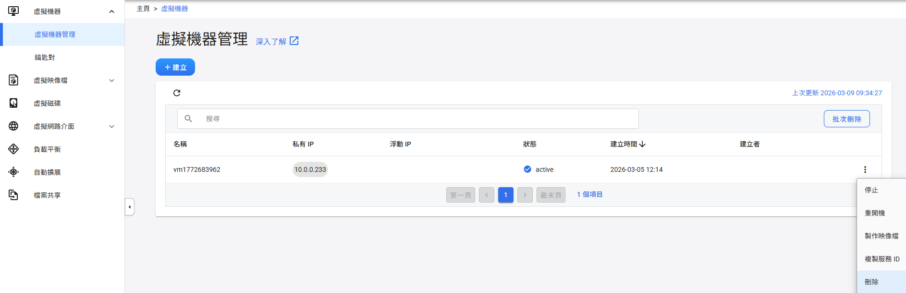

---

## 常用指令速查

```bash
# --容器管理----------------------------------------------
# 首次啟動（容器不存在時）
docker run -d \
    --name physicsnemo-bootcamp \
    --gpus all --ipc=host \
    --ulimit memlock=-1 --ulimit stack=67108864 \
    -p 8888:8888 -p 8889:8889 \
    -e NVIDIA_VISIBLE_DEVICES=all \
    -e NVIDIA_DRIVER_CAPABILITIES=compute,utility \
    -v ~/AI-Powered-Physics-Bootcamp:/workspace/AI-Powered-Physics-Bootcamp \
    physicsnemo-bootcamp:25.06

# 停止容器
docker stop physicsnemo-bootcamp

# 重新啟動已存在的容器（VM重開機後使用）
docker start physicsnemo-bootcamp

# 移除容器（停止後才可執行）
docker rm physicsnemo-bootcamp

# --狀態查看----------------------------------------------
docker ps
docker logs -f physicsnemo-bootcamp

# --進入容器terminal-------------------------------------
docker exec -it physicsnemo-bootcamp bash

# --GPU監控----------------------------------------------
# Host上即時監控
watch -n 1 nvidia-smi

# 容器內監控（在JupyterLab terminal執行）
nvidia-smi dmon -s pucvmet

# --重新build image--------------------------------------
docker build --no-cache -t physicsnemo-bootcamp:25.06 ~/physicsnemo-workshop/
```

---

## 疑難排解

### GPU無法在容器記憶體取

> 錯誤訊息：`could not select device driver "nvidia" with capabilities: [[gpu]]`

```bash
sudo nvidia-ctk runtime configure --runtime=docker
sudo systemctl restart docker
```

---

### 容器啟動失敗：Driver Not Loaded

> 錯誤訊息：`failed to initialize NVML: Driver Not Loaded`

VM連線中斷後恢復可能導致NVIDIA kernel module未載入。

#### 方法一：重新載入module（最快）

```bash
sudo modprobe nvidia
sudo systemctl restart docker
docker start physicsnemo-bootcamp
```

#### 方法二：若出現`Module nvidia not found in directory /lib/modules/<kernel>`，代表目前kernel缺少對應的module，需重新編譯：

```bash
# 安裝目前kernel headers
sudo apt-get install linux-headers-$(uname -r)

# 觸發DKMS為目前kernel重新編譯module
sudo dkms autoinstall

# 重啟Docker並啟動容器
sudo systemctl restart docker
docker start physicsnemo-bootcamp
```

#### 方法三：若DKMS失敗，重裝Driver（最穩定）：

```bash
sudo apt-get install --reinstall nvidia-driver-570
sudo reboot
# 重開機後重新SSH登入
docker start physicsnemo-bootcamp
```

---

### Driver版本不匹配

> 錯誤訊息：`Failed to initialize NVML: Driver/library version mismatch`

```bash
sudo reboot
```

---

### 無法pull base image (unauthorized)

> 錯誤訊息：`unauthorized: authentication required`

NGC公開Catalog image偶爾會更新版本，舊版仍可直接pull，新版若遇到此錯誤，可至[NGC Catalog](https://catalog.ngc.nvidia.com/orgs/nvidia/teams/physicsnemo/containers/physicsnemo)確認仍公開的tag，或免費註冊NGC帳號後執行：

```bash
docker login nvcr.io -u '$oauthtoken' -p <YOUR_NGC_API_KEY>
```

---

### JupyterLab無法從外部存取

```
# Ubuntu ufw防火牆
sudo ufw allow 8888/tcp
sudo ufw reload
sudo ufw status
```

Cloud VM請在Security Group / Firewall Rules中開放TCP port 8888 inbound。

---

### 容器記憶體不足(OOM)

確認`docker run`指令包含以下參數：

```
--ipc=host
--ulimit memlock=-1
--ulimit stack=67108864
```

---

## 版本更新說明

| Image Tag	| CUDA版本	| 狀態 |
| ---------	| --------	| ---- |
| `25.06`	| 12.4	        | 穩定，本手冊預設版本 |
| `25.08`	| 12.5  	| 穩定 |
| `25.11`	| 12.6	        | 最新版（注意：`onnxruntime-gpu`尚不支援CUDA 13.x） |

**切換版本**：重新build時指定新的tag：

```bash
docker build --build-arg PHYSICSNEMO_VERSION=25.11 -t physicsnemo-bootcamp:25.11 ~/physicsnemo-workshop/
```

可用tag清單請至[NGC Catalog](https://catalog.ngc.nvidia.com/orgs/nvidia/teams/physicsnemo/containers/physicsnemo)確認。

---

## TA工具｜一鍵自動安裝腳本

> 適用情境：TA需要快速重建環境、或補課學員需要從頭設定時使用。

SSH登入VM後，執行以下指令：

```bash
cd ~
git clone https://github.com/kevin5826536/physicsnemo_bootcamp_setup.git
cd ~/physicsnemo_bootcamp_setup
bash setup.sh
```

Script會自動完成步驟1&ndash;10，包含：

 -  確認GPU、安裝Driver（若需要）、安裝Docker與NVIDIA Container Toolkit
 -  Clone bootcamp教材、建立Dockerfile、build image、啟動JupyterLab

> **若NVIDIA Driver尚未安裝**：script安裝完成後會提示`sudo reboot`。
> 重開機並重新SSH登入後，**再次執行`bash setup.sh`**即可從中斷處繼續。

> Script為冪等設計，已完成的步驟會自動略過，可安全重複執行。

---

## 參考資料

 -  [NVIDIA PhysicsNeMo官方檔案](https://docs.nvidia.com/physicsnemo/latest/)
 -  [NGC PhysicsNeMo Container Catalog](https://catalog.ngc.nvidia.com/orgs/nvidia/teams/physicsnemo/containers/physicsnemo)
 -  [AI-Powered Physics Bootcamp GitHub](https://github.com/openhackathons-org/AI-Powered-Physics-Bootcamp)
 -  [Bootcamp官方Dockerfile](https://github.com/openhackathons-org/AI-Powered-Physics-Bootcamp/blob/main/Dockerfile)
 -  [NVIDIA Container Toolkit安裝指南](https://docs.nvidia.com/datacenter/cloud-native/container-toolkit/install-guide.html)

<!--
  vim:ft=markdown ic noet norl wrap sw=4 sts=4 ts=8:
  -->
